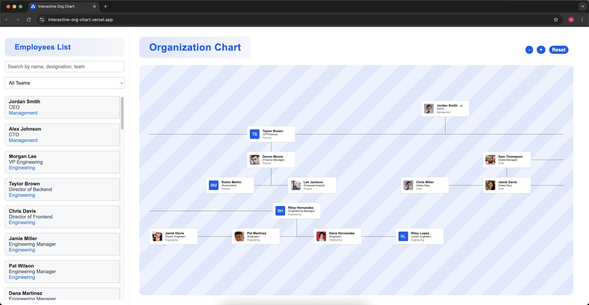

# Employee Organization Chart

This project is a modern React application for visualizing and managing an interactive employee organization chart. It features drag-and-drop manager assignment, filtering, and smooth zoom/pan navigation for scalable org structures.

## Features

- **Interactive Org Chart**: Visualizes employee hierarchy in a clear, tree-like structure.
- **Drag-and-Drop**: Change an employee's manager by dragging nodes in the chart.
- **Filtering & Search**: Quickly find employees by name, designation, or team.
- **Pinch/Zoom/Pan**: Navigate large org charts with intuitive gestures.
- **Responsive UI**: Sidebar controls are always visible; employee list is scrollable.
- **Accessible & Modern Design**: Clean layout, color contrasts, and keyboard navigation support.

## Why Bun?

This project uses [Bun](https://bun.sh/) as the JavaScript runtime and package manager, alongside Vite for fast development and builds. Bun offers:

- Much faster installs and script execution than npm or yarn
- Native TypeScript and JSX support
- Improved developer experience with modern features
- Seamless compatibility with Vite and React

**Note:** You must use Bun for all commands (not npm or yarn).

## Architecture & File Structure

```
org-chart
├── src
│   ├── App.tsx            # Main app component
│   ├── App.css            # Global app styles
│   ├── index.css          # Base CSS
│   ├── main.tsx           # App entry point
│   ├── mockEmployees.ts   # Realistic mock employee data
│   ├── vite-env.d.ts      # Vite/TS env types
│   ├── components         # UI components
│   │   ├── CustomNode.tsx   # Custom org chart node renderer
│   │   ├── EmployeeNode.tsx # Individual employee node
│   │   ├── OrgChart.tsx     # Org chart logic & rendering
│   │   ├── OrgChart.css     # Org chart styles
│   │   ├── Sidebar.tsx      # Sidebar filter/search
│   │   ├── Sidebar.css      # Sidebar styles
│   ├── services           # API/data services
│   │   └── employeeService.ts # Employee API logic
│   ├── utils              # Utility functions
│   │   └── buildTreeData.ts   # Org tree construction/cycle prevention
├── public
│   └── index.html         # HTML entry point
├── package.json           # Project metadata & scripts
├── bun.lock               # Bun package lock
├── tsconfig.json          # TypeScript config
├── tailwind.config.js     # Tailwind CSS config
├── vite.config.ts         # Vite build config
└── README.md              # Project documentation
```

## Getting Started

1. **Install Bun:**
   [Follow Bun installation instructions](https://bun.sh/docs/installation)

2. **Clone the repository:**
   ```
   git clone <repository-url>
   cd org-chart
   ```
3. **Install dependencies:**
   ```
   bun install
   ```
4. **Start the development server:**
   ```
   bun run dev
   ```

5. **Open the app:**
   Visit `http://localhost:5173` in your browser.

## Running Tests

Unit and integration tests are written using [Vitest](https://vitest.dev/) and [React Testing Library](https://testing-library.com/docs/react-testing-library/intro/).

To execute all tests:

```
bun run test
```

Test coverage includes:
- API service logic (employeeService)
- Org chart tree building and cycle prevention
- Sidebar filtering and search
- CustomNode rendering (photo fallback, lock icon)
- App integration (loading, error, manager change)

Snapshot testing is not used; all tests are logic- and UI-driven.

## Deployment

This app is deployed on Vercel and accessible at:  
[https://interactive-org-chart.vercel.app/](https://interactive-org-chart.vercel.app/)



## Development Experience

<details>
<summary>📖 <strong>Decision Points & Considerations</strong></summary>

### 1. Project Setup & Tooling

- **Vite + React + TypeScript** for fast builds, type safety, and modern DX.
- **Bun** for local dev speed and package management.
- **TypeScript** chosen for strong typing, maintainability, and team scaling.
- **react-d3-tree**: Org chart rendering, zoom/pan
- **MirageJS**: Mock API server for development/testing
- **Vitest**: Unit and integration testing
- **React Testing Library**: UI testing utilities
- **Tailwind CSS**: Utility-first CSS framework

### 2. Org Chart Rendering

- Considered custom recursive tree layout vs. react-d3-tree.
- **Chose react-d3-tree** for:
   - Performance with large datasets
   - Built-in zoom, pan, responsive layouts
   - Easier scaling and maintenance

### 3. Drag & Drop (DND)

- Evaluated custom drag logic vs. dnd-kit.
- **Picked dnd-kit** for:
   - Accessibility focus
   - Extensible API for drop validation
   - Good React integration
- **Challenge:** Panning + dragging conflict → solved with Edit Mode toggle.

### 4. Safe-Drop Logic

- Prevented invalid org structures:
   - No cycles (employee can’t become manager of their ancestor)
   - No self-drops
   - Root node (CEO) locked from drag, only droppable
- **Decision:** Flexible reporting allowed, but hierarchy integrity preserved.

### 5. Search & Filtering

- Added search box (fuzzy matching by name, designation, team)
- Added team filter (applies to sidebar and chart for consistent UX)

### 6. Scalability

- Mock data with 40+ employees to test performance
- Ensured smooth pan/zoom for large trees
- Chose react-d3-tree for future large data support

### 7. Accessibility & UX

- Keyboard accessibility (dnd-kit)
- Visual cues:
   - Hover highlight on droppable areas
   - 🔒 lock indicator for CEO/root node
- Considered pinch-zoom for trackpads & mobile

### 8. Styling Choices

- Avoided heavy CSS frameworks
- Used CSS-in-JS + minimal custom CSS for control
- Focus: maintainability, no global style conflicts

### 9. Future Enhancements (Out of Scope)

- Persisting changes via API (updateManager endpoint)
- Animations for drag ghost (dnd-kit overlays)
- Collapsible subtrees for very large orgs
- Role-based rules (e.g., VPs must always report to CEO)

</details>